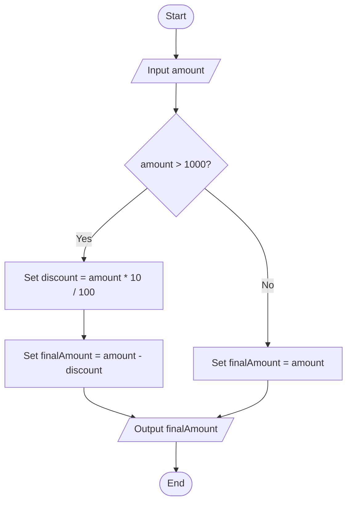

# Question 10 — Discount

## Task

Input the purchase amount. If the amount is greater than 1000, apply a 10% discount and display the final amount.

## Pseudocode

START
INPUT amount

IF amount > 1000 THEN
SET discount = amount * 10 / 100
SET finalAmount = amount - discount
ELSE
SET finalAmount = amount
END IF

OUTPUT finalAmount

END

## Flowchart

## Example

If amount = 1500:

Discount = 1500 * 10 / 100 = 150

Final amount = 1500 - 150 = 1350

If amount = 1000:

Final amount = 1000
