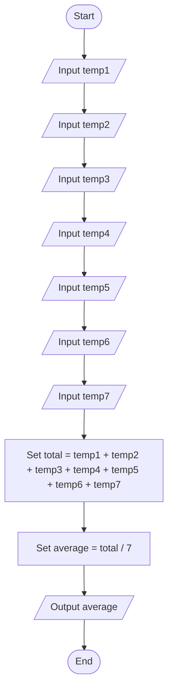

# Question 6 — Average Temperature

## Task

Input the temperatures for 7 days, then calculate and display the average temperature.

## Pseudocode

START
INPUT temp1
INPUT temp2
INPUT temp3
INPUT temp4
INPUT temp5
INPUT temp6
INPUT temp7

SET total = temp1 + temp2 + temp3 + temp4 + temp5 + temp6 + temp7
SET average = total / 7

OUTPUT average

END

## Flowchart

## Example

If the temperatures are:

* 20
* 22
* 18
* 21
* 19
* 23
* 17

Then:

Total = 140

Average = 20
