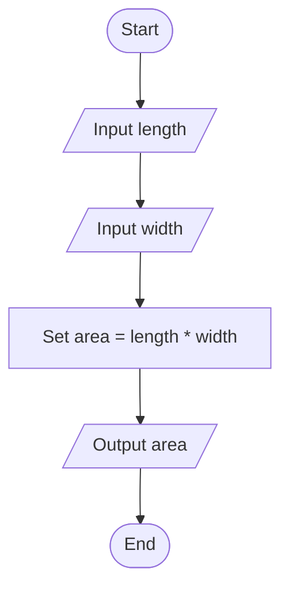

# Question 7 — Area of Rectangle

## Task

Input the length and width of a rectangle, then calculate and display its area.

## Pseudocode

START
INPUT length
INPUT width

SET area = length * width

OUTPUT area

END

## Flowchart

## Example

If:

* Length = 7
* Width = 5

Then:

Area = 7 * 5 = 35

