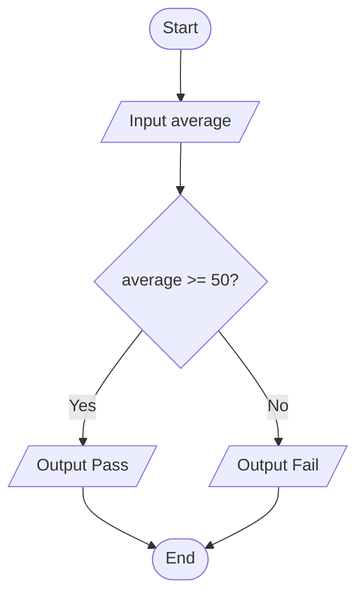

# Question 8 — Pass/Fail

## Task

Input a student's average mark, then display Pass if the average is 50 or higher; otherwise display Fail.

## Pseudocode

START
INPUT average

IF average >= 50 THEN
OUTPUT "Pass"
ELSE
OUTPUT "Fail"
END IF

END

## Flowchart

## Example

If average = 75:

Output = Pass

If average = 49:

Output = Fail

If average = 50:

Output = Pass
