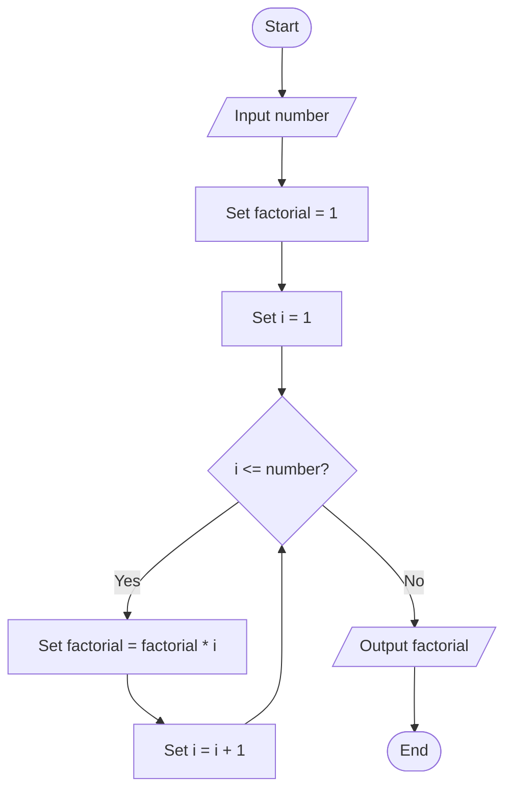

# Question 9 — Factorial

## Task

Input a number, calculate its factorial using a loop, then display the result.

## Pseudocode

START
INPUT number

SET factorial = 1
SET i = 1

WHILE i <= number
SET factorial = factorial * i
SET i = i + 1
END WHILE

OUTPUT factorial

END

## Flowchart

## Example

If number = 5:

Factorial = 1 × 2 × 3 × 4 × 5

Factorial = 120
